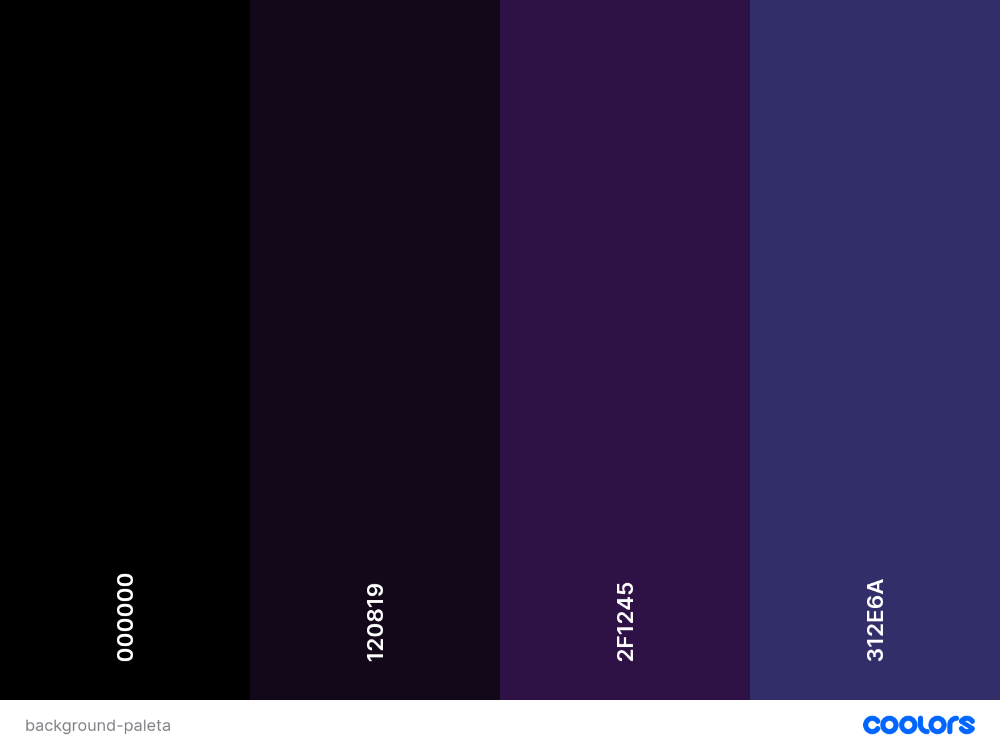
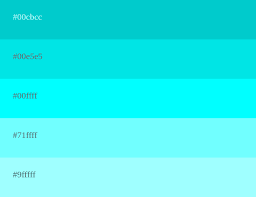
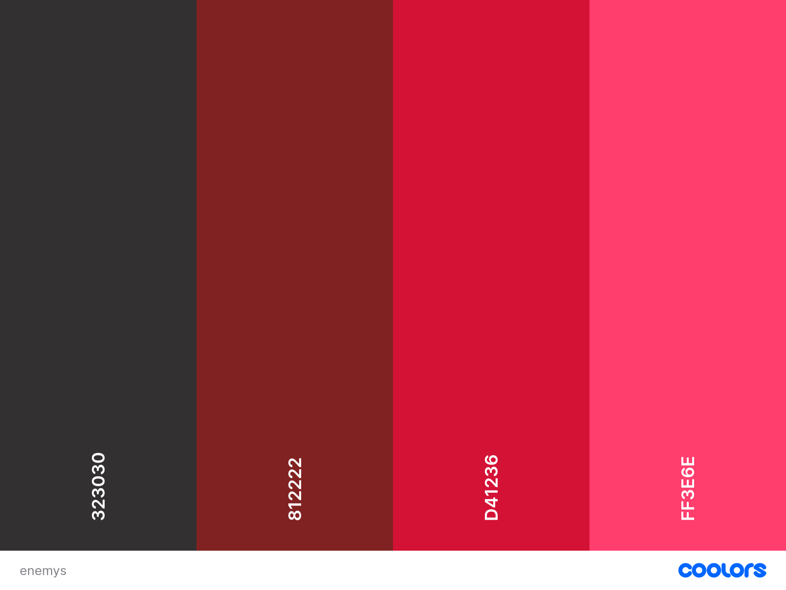
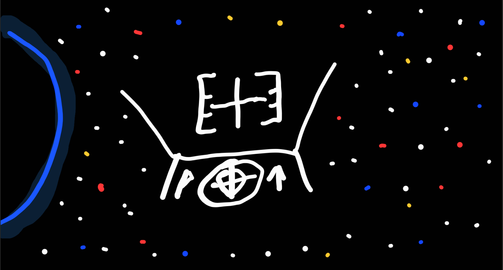
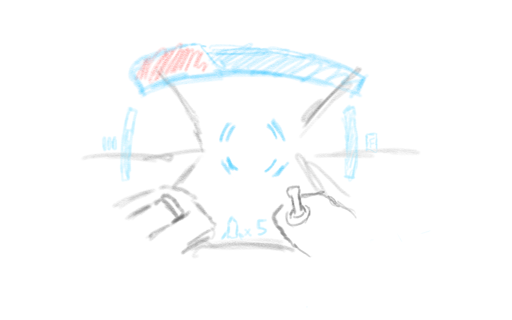
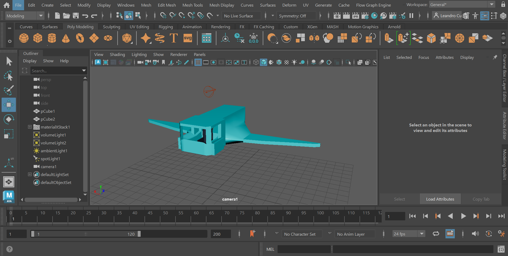
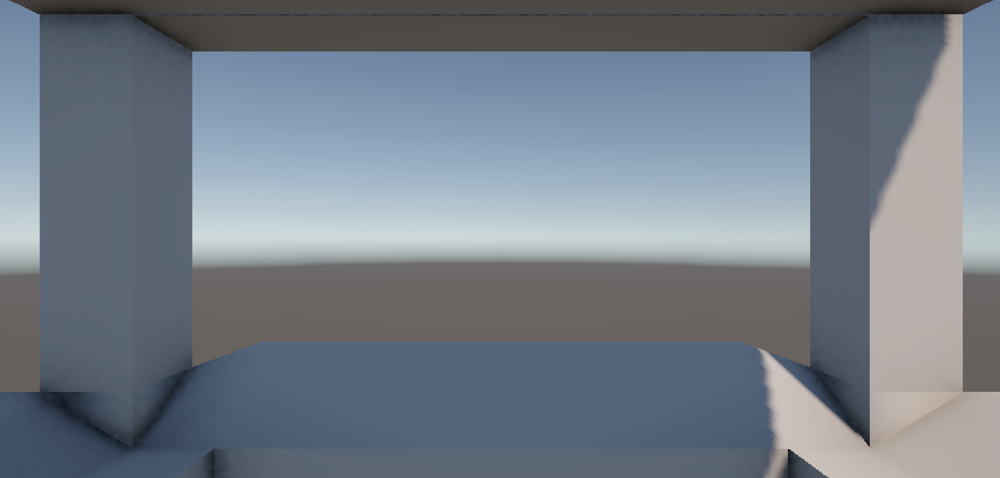
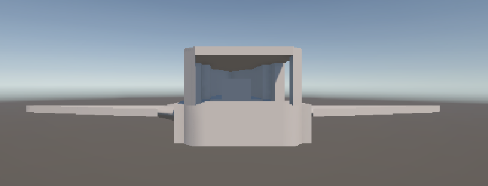
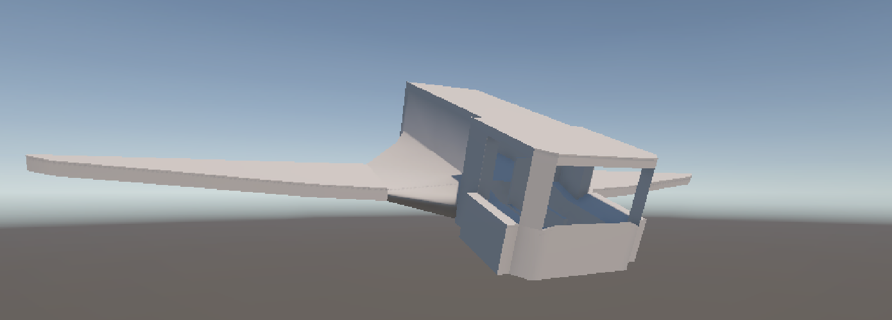
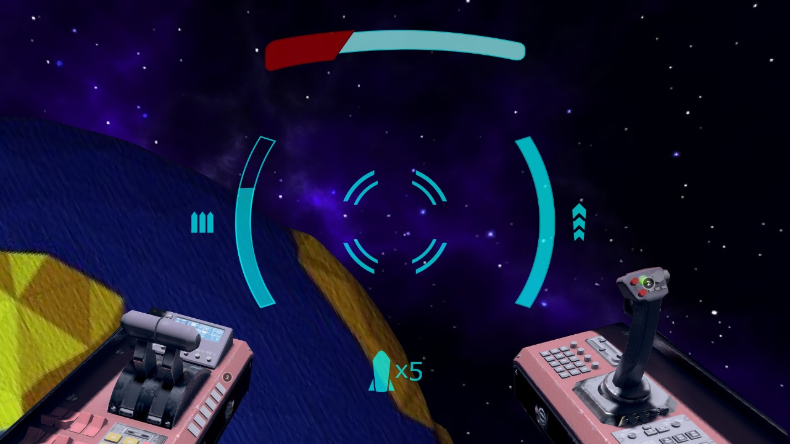

## Conceito Inicial

O projeto é um rail shooter inspirado em clássicos como *Starfox*, que busca proporcionar uma experiência imersiva em realidade virtual. O jogador assume o papel de um piloto atirador cuja missão é proteger planetas da destruição, enfrentando uma chuva de meteoritos e repelindo invasores extraterrestres. A ação se desenrola a bordo de uma espaçonave posicionada em órbita terrestre, servindo como a última linha de defesa contra essas ameaças.

## Ambientação

O jogo é ambientado na espaço sideral, onde o jogador explora as órbitas de diferentes planetas. Cada fase é centrada em um planeta único, apresentando inimigos e obstáculos temáticos que refletem as características e desafios específicos de cada ambiente. Essa diversidade oferece uma experiência dinâmica e imersiva, colocando o jogador em situações variadas enquanto luta para proteger os planetas.  O visual almeja uma aparência scifi minimalista, utilizando de modelos lowpoly e efeitos de Neon, para identificar os objetos na cena de forma simplificada.

### Paleta de cores:

A paleta de cores foi pensada com o propósito de criar contraste entre o universo que o jogador está imerso, bem como a sua nave e os inimigos que os cercam, tornando o processo de percepção de obstáculos o mais efetivo possível.

#### Paleta do background "Universo"
Para a criação da paleta de cores do universo, foram utilizados tonalidades de roxo e preto, para remeter ao ar de mistério e criatividade, temas que se encaixam tanto com o tema futurista abordado no game, quanto à imensidão do universo representado na cena.

#### Paleta de cores da nave do jogador
Ao elaborar a paleta de cores da visualização da nave, foi considerada a cor azul em tons claros e Neons, para simbolizar que a nave que o jogador está pilotando é um local seguro. É importante salientar que toda a visualização da nave por parte do jogador será por meio de uma "projeção holográfica" e transparênte da mesma, possibilitando que o jogador consiga enxergar os obstáculos à frente das partes da nave, reduzindo o nível de obstrução da visão do jogador. 

#### Paleta de cores dos inimigos
Por fim, a paleta de cores dos inimigos foi baseada em tons de vermelho vibrante, com o objetivo tanto de representar o perigo, quanto de criar um efeito de contraste com a nave vista do lado de dentro pelo jogador.

## Painel de Referencias 
<!-- Colocar Link Miro -->
- Visão de um EVA Evangelion
- Circulo de fogo
- Star Fox
- Asteroids
- Zone of The Enders

## Ciclo de Feedback + Flow

O design do jogo foi concebido para manter o jogador em um estado de engajamento contínuo, equilibrando desafio e recompensa. O ciclo de feedback e o flow são estruturados da seguinte forma.

1. **Ciclo de Ação e Recompensa**:  
   - Durante o gameplay, o jogador é constantemente desafiado a **desviar de obstáculos, destruir meteoritos e derrotar inimigos.** Feedback imediato é fornecido por meio de:
     - **Efeitos Visuais e Sonoros**: Explosões, partículas e sons ao acertar inimigos ou desviar de perigos.
     - **Pontuação e Multiplicadores**: A performance do jogador é recompensada com pontos, bônus e aprimoramentos temporários, como armas secundárias ou escudos.
     - **Vibração**: Sistema de vibração dos controles acionados quando o o usuário está atirando no alvo.

O estado de Flow se encontra na jogatina do jogo, o engajamento para conseguir finalizar a fase com uma boa pontuação. Existem vários aspectos para conseguir manter e/ou criar picos de Flow, sendo eles:

### Características do estado de flow:

1. **Clareza de objetivos**: O jogador sabe exatamente o que precisa fazer e quais são suas metas no jogo.
2. **Equilíbrio entre desafio e habilidade**: O jogo apresenta dificuldades que não são fáceis demais (evitando o tédio) nem impossíveis (evitando frustração).
3. **Feedback imediato**: O jogador recebe respostas rápidas e claras sobre suas ações, como acertos, erros e progresso.
4. **Sensação de controle**: O jogador sente que suas habilidades e decisões têm impacto direto nos resultados.
5. **Imersão completa**: O jogador está tão concentrado que perde a noção do tempo e ignora distrações externas.
6. **Satisfação intrínseca**: A atividade em si é recompensadora, independentemente de recompensas externas.

## Narrativa + Árvore de interações

### Narrativa:
A narrativa consiste no seguinte storytelling: Você é um astronauta de uma realidade futurista, porém, nesse futuro distante, os cargos de astronautas não são todos voltados para exploração. No seu caso, você é um astronauta chamado de "Zelador". Seu trabalho consiste em voar com sua espaçonave pelas órbitas dos planetas ocupados pelos humanos, utilizando as armas da sua nave para eliminar quaisquer tipos de destroços, meteoros, lixo e neutralizar qualquer tipo de invasor alienigena, que possam vir a causar danos. Ao longo da sua jornada, a nave disponibiliza aulas de história sobre os planetas que estão sendo orbitados. Elimine toda a ameaça nas órbitas e descubra a história dos planetas colonizados para concluir o jogo.

### Árvore de Interações
De maneira objetiva, o jogador consegue se movimentar nos eixos X e Y, dentro de um corredor de espaço delimitado, ao passo que a nave se movimenta de forma automática para a frente. O jogador possui a possibilidade de alterar a velocidade da mesma, aumentando-a ou reduzindo-a. Por fim, o jogador pode atirar, sendo que a mira do disparo é realizada com a própria movimentação da nave, ou seja, o disparo sempre parte do "centro" da nave.

Para uma visão mais detalhada, acesse o <a href="https://twinery.org/2/#/stories/68081cfa-4f79-46e0-9f9b-da9d99e355c4" target="_blank">Twine</a>

## Level Design

Para o desenvolimento do jogo, primeiramente é criado um esboço inicial do jogo com o intuito de guiar as ideias iniciais antes do desenvolvimento. Isso ajuda e define com maior clareza, qual será o design e funcionalidades básicas do jogo. Sendo assim, segue a baixo os 2 esboços iniciais da tela de jogatina.

### 1° Conceito

O primeio conceito do jogo está mais voltado a coloração do jogo, como seria cenário de fundo para o jogador, o que seria visto de forma inicial e minimalista do painél da nave.

### 2° Conceito (Complementar)

O segundo conceito complementa o primeiro, apresentando com mais detalhes a estrutura da nave e os elementos do cockpit, como a mira, os sensores de detecção e os controles localizados nos cantos inferiores opostos da interface. No lado direito, encontra-se o controle de movimentação da aeronave, cujo movimento é refletido diretamente no jogo. Já no lado esquerdo, há uma alavanca responsável pelo controle do propulsor, ajustando a velocidade da nave.

## Seleção de Assets

Os assets para os objetos do jogo serão desenvolvidos pela equipe, utilizando Maya para modelagem 3D. O objetivo é criar modelos de naves e inimigos que comporão as cenas e menus do jogo. Como testes iniciais, foram modeladas as primeiras malhas da nave, além da importação dos mesmos para a Unity. Abaixo, seguem as imagens que ilustram o progresso:

### Modelagem inicial da nave utilizando o Maya

### Visão interna da nave 
A visão interna da nave, renderizada no Unity, mostra a primeira versão do cockpit e a disposição dos controles.

### Visualização externa da nave
Aqui estão as imagens que mostram a visualização externa da nave, incluindo detalhes sobre seu design e a integração no ambiente do jogo. Este tipo de visualização será utilizado em menus.

## Wireframes VR

Para planejar a disposição dos objetos na cena sob a perspectiva do jogador, criamos um wireframe que ilustra a posição do manche da nave, a mira e o cenário observado pela janela da nave.

