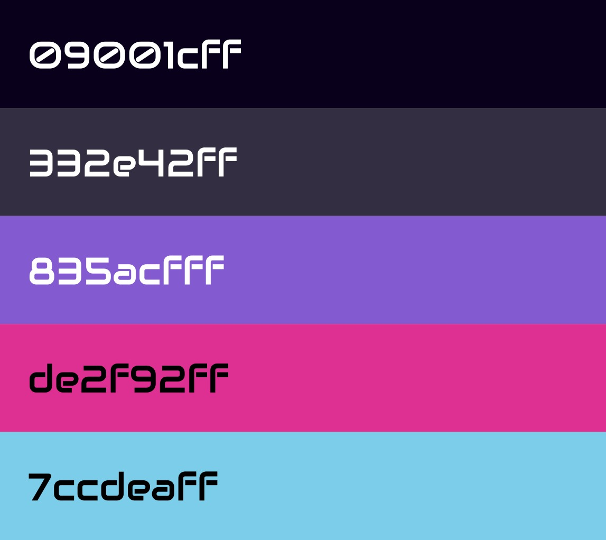
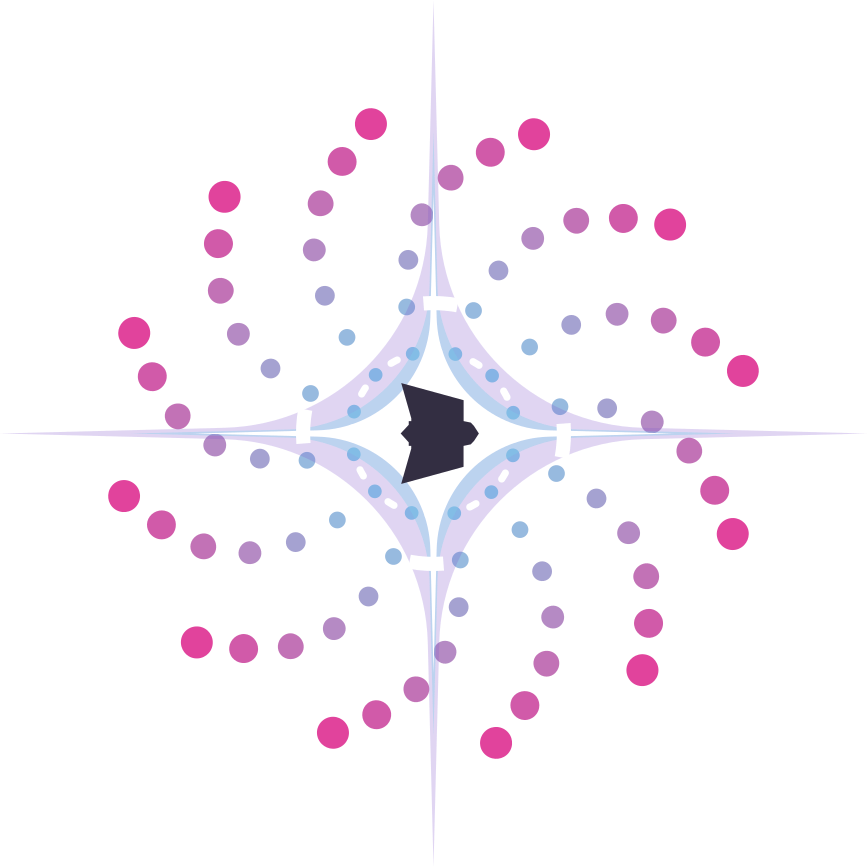
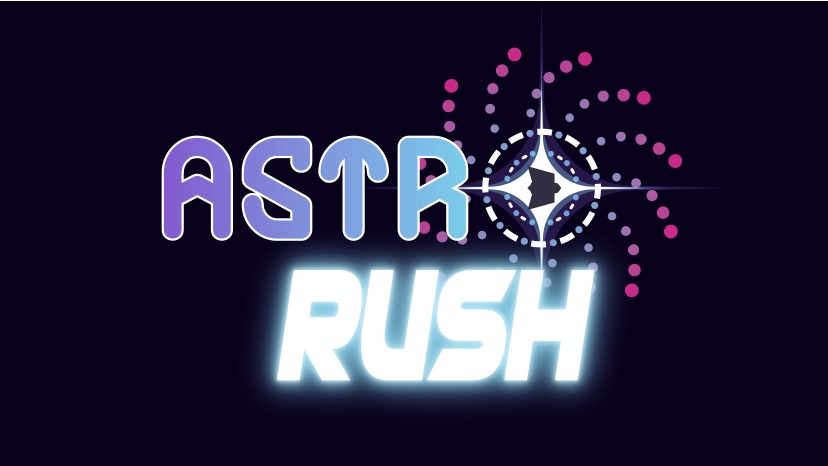

# Identidade Visual

Este documento tem como objetivo apresentar a identidade visual, que é um conjunto de elementos gráficos que representam o projeto. Ela é composta por elementos como logotipo, tipografia, paleta cromática, iconografia e texturas. Ter uma identidade visual é importante para que o projeto seja facilmente reconhecido e para que ele tenha uma identidade única.

Utilizamos os seguintes elementos para a construção da identidade visual do projeto:

## Tipografia

A tipografia é um o elemento visual que representa a forma como o texto é apresentado.

Para o nome do projeto, foram usadas duas fontes, sendo elas: **_Future_** para a palavra _"Astro"_

e **_Future Edge_** para a palavra _"Rush"_.

Ambas as fontes são sem serifa e possuem um estilo futurista, que remete ao tema do projeto.

 

## Paleta cromática

A paleta cromática é um conjunto de cores que são utilizadas no projeto. Ela é composta por cores que se complementam e que representam o tema do projeto. A paleta cromática do projeto é composta pela seguinte sequência de cores, representadas em hexadecimal:

**09001CFF:** A cor utilizada para representar o fundo do logotipo.

**332E42FF:** A cor que representa a nave do ícone do logotipo.

**835ACFFF:** A cor que utilizada na palavra _"Astro"_ e em elementos do ícone do logotipo.

**DE2F92FF:** A cor utilizada em elementos do ícone do logotipo.

**FCCDEAFF:** A cor utilizada na palavra _"Rush"_ e em elementos do ícone do logotipo.

Abaixo, é possível visualizar a paleta cromática do projeto:

 

## Iconografia

A iconografia é um conjunto de elementos gráficos que representam o projeto.

O ícone do logotipo é composto por uma nave espacial, que representa o tema do projeto. A nave é composta por formas geométricas como hexágono para a base e trapézios para as asas. Ao redor da nave, há círculos que representam órbitas com esferas representando os planetas. No externo das órbitas, há esferas de diferentes cores e tamanhos, representando os "inimigos", que serão obstáculos para a nave.

 

### Texturas

As texturas são elementos gráficos que são utilizados para dar mais profundidade e realismo ao projeto. Para a identidade visual do projeto, o grupo optou por não utilizar desta ferramenta, pois a paleta cromática e a iconografia já são suficientes para representar o tema do projeto.

 

# Logotipo

O logotipo é uma representação gráfica do que o projeto representa. Ele tem a finalidade de tornar a marca mais facillmente reconhecida.

A construção dos elementos explicados anteriormente resultou no logotipo do projeto, que é composto pelas palavras _"Astro Rush"_ e pelo ícone que representa a nave espacial e os planetas, o qual pode ser visto a seguir:

 

# Referências

1. FONTSPACE. Fonte Future. Disponível em: https://www.fontspace.com/search?q=future. Acesso em: 16 dez. 2024.

2. FONTSPACE. Fonte Future Edge. Disponível em: https://www.fontspace.com/search?q=future+edge. Acesso em: 16 dez. 2024.

3. GRUPO 3. Ícone da nave espacial. Produzido através do software Inkscape. Disponível em: https://inkscape.org/. Acesso em: 16 dez. 2024.

4. GRUPO 3. Paleta cromática. Produzida através do software Inkscape. Disponível em: https://inkscape.org/. Acesso em: 16 dez. 2024.

5. GRUPO 3. Logotipo. Produzido através do software Inkscape. Disponível em: https://inkscape.org/. Acesso em: 16 dez. 2024.

6. WHEELER, Alina; COSTA, Francisco A. Design de Identidade da Marca: Guia Essencial para Toda a Equipe de Gestão de Marcas. Porto Alegre: Bookman, 2019.