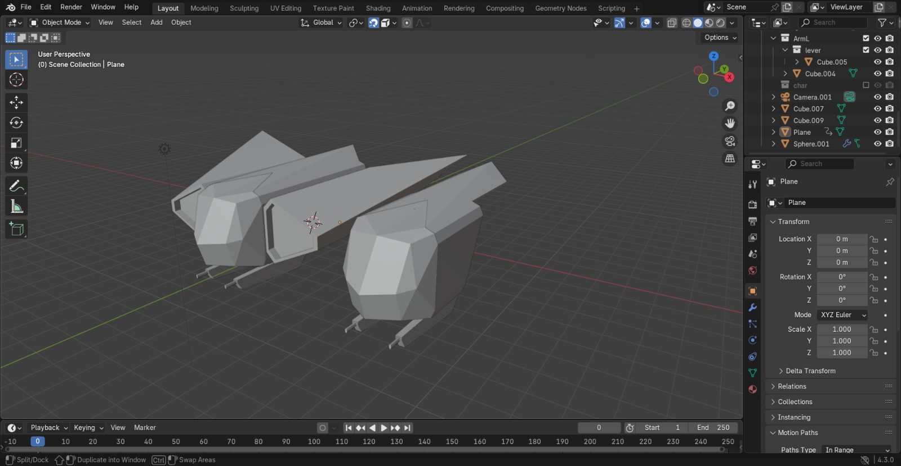
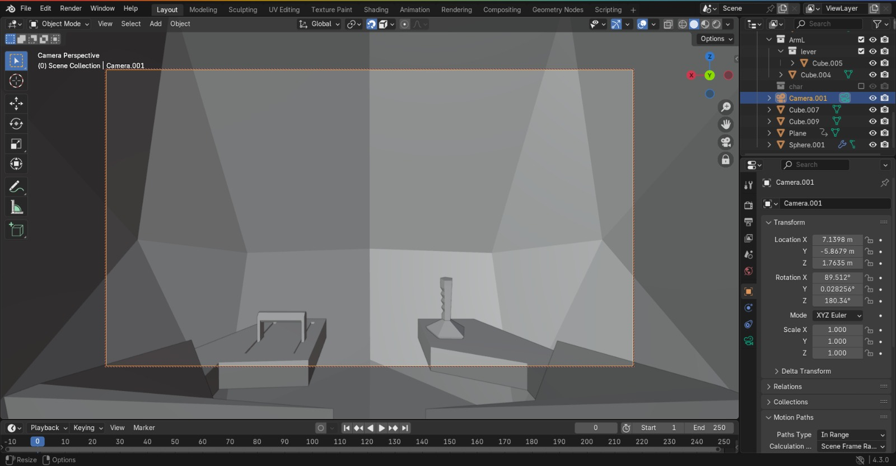

# Assets Implementados  
Aqui está uma lista dos assets que foram utilizados até então na demonstração do dia 17/12.  

### 1. Skybox Personalizada  
O grupo optou por desenhar a Skybox que é utilizada na cena, a mesma que constitui um ambiente espacial com detalhes em roxo e estrelas.  

  

### 2. Nave  
A nave foi desenhada por nós, tanto no espaço interno como externo, tendo um visual que relembra a pegada urbano-futurista.  

  
  

### 3. Planeta  
Foi desenvolvido um planeta como asset para compor o ambiente e futuramente servir como ponto de colisão. A estrutura em si é inspirada em Saturno, mas alteramos as cores para parecer um planeta genérico.  

  

## Próximos Assets  
Já temos alguns dos assets que planejamos usar nos próximos passos. Alguns deles são:  

### 1. Inimigo  
O inimigo será feito a partir do asset atual da nave, com a paleta de cores alterada.  

### 2. Meteoro  
O meteoro seguirá a mesma linha do planeta, mas devidamente reduzido e sem elementos como o arco, apesar de possivelmente ainda ter algumas cores vibrantes para melhorar a experiência do jogador.  
